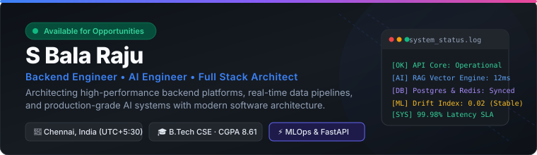
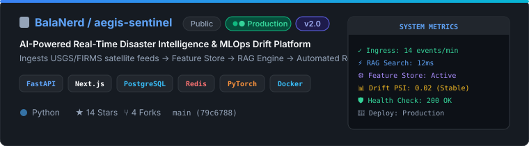
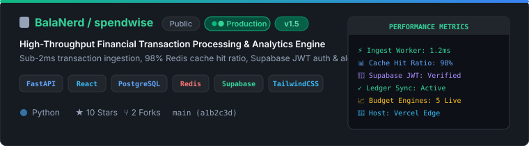
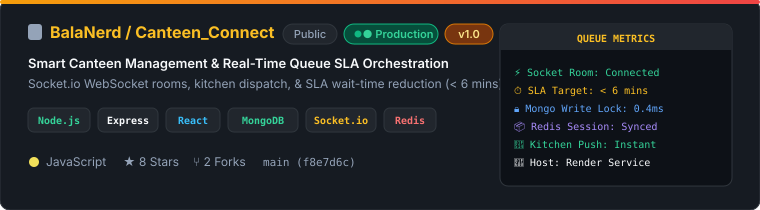

<div align="center">
  
</div>

<br/>

<p align="center">
  <a href="https://github.com/BalaNerd">
    
  </a>
  &nbsp;
  <a href="https://www.linkedin.com/in/s-balaraju/">
    
  </a>
  &nbsp;
  <a href="mailto:balaraju1805@gmail.com">
    
  </a>
</p>

<br/>

<!-- ===================================================
     §1 · ABOUT ME / EXECUTIVE SPECIFICATION
==================================================== -->

### ⚡ Executive Profile

```
┌───────────────────────────┬─────────────────────────────────────────────────────────────┐
│ Specification             │ Details                                                     │
├───────────────────────────┼─────────────────────────────────────────────────────────────┤
│ 📍 Location               │ Chennai, India (UTC +05:30)                                 │
│ 🎓 Education              │ B.Tech CSE (Big Data Analytics) · SRM IST (CGPA: 8.61/10.0) │
│ 💼 Internship             │ Data Scientist & Analyst Intern @ Zidio Development         │
│ 🔨 Active Focus           │ Aegis Sentinel v2 (MLOps Drift) & SpendWise Beta            │
│ 🔬 Research Focus         │ Distributed Systems · Zero-Trust Security · RAG Pipelines   │
└───────────────────────────┴─────────────────────────────────────────────────────────────┘
```

<br/>

<!-- ===================================================
     §2 · FEATURED REPOSITORIES SHOWCASE
==================================================== -->

### 📦 Featured Repository Projects

<div align="center">
  <a href="https://github.com/BalaNerd/aegis-sentinel">
    
  </a>
</div>

<p align="center">
  <a href="https://github.com/BalaNerd/aegis-sentinel">
    
  </a>
</p>

<br/>

<div align="center">
  <a href="https://github.com/BalaNerd/spendwise">
    
  </a>
</div>

<p align="center">
  <a href="https://github.com/BalaNerd/spendwise">
    
  </a>
  &nbsp;&nbsp;
  <a href="https://spendwise-two-kappa.vercel.app/">
    
  </a>
</p>

<br/>

<div align="center">
  <a href="https://github.com/BalaNerd/Canteen_Connect">
    
  </a>
</div>

<p align="center">
  <a href="https://github.com/BalaNerd/Canteen_Connect">
    
  </a>
  &nbsp;&nbsp;
  <a href="https://canteen-connect.onrender.com">
    
  </a>
</p>

<br/>

<!-- ===================================================
     §3 · TECHNOLOGY ECOSYSTEM WITH OFFICIAL LOGOS
==================================================== -->

### 🛠️ Technology Stack & Ecosystem

<table width="100%">
  <tr>
    <td width="20%" valign="top"><strong>⚙️ Backend Engine</strong></td>
    <td width="80%">
      
      
      
      
      
      
      
    </td>
  </tr>
  <tr>
    <td width="20%" valign="top"><strong>🤖 AI &amp; Data Science</strong></td>
    <td width="80%">
      
      
      
      
      
      
    </td>
  </tr>
  <tr>
    <td width="20%" valign="top"><strong>🌐 Frontend UI</strong></td>
    <td width="80%">
      
      
      
      
      
      
    </td>
  </tr>
  <tr>
    <td width="20%" valign="top"><strong>🛢️ Databases &amp; Caching</strong></td>
    <td width="80%">
      
      
      
      
      
    </td>
  </tr>
  <tr>
    <td width="20%" valign="top"><strong>☁️ Cloud &amp; DevOps</strong></td>
    <td width="80%">
      
      
      
      
      
      
    </td>
  </tr>
</table>

<br/>

<!-- ===================================================
     §4 · ENGINEERING PHILOSOPHY & OPERATIONAL CARDS
==================================================== -->

### 📐 Engineering Philosophy

<table width="100%">
  <tr>
    <td width="50%" valign="top">
      <h4>🔍 1. Observability First</h4>
      <p>Every microservice ships with structured JSON logging, health check endpoints, and automated drift telemetry built into the pipeline at inception.</p>
    </td>
    <td width="50%" valign="top">
      <h4>🛡️ 2. Boundary Integrity</h4>
      <p>Strict schema validation, idempotent operations, and zero-trust authentication defaults across every public &amp; private API boundary.</p>
    </td>
  </tr>
  <tr>
    <td width="50%" valign="top">
      <h4>⚡ 3. Minimal Surface Area</h4>
      <p>Expose explicit, minimal endpoints while keeping internal system complexity strictly encapsulated inside optimized internal workers.</p>
    </td>
    <td width="50%" valign="top">
      <h4>🚀 4. Continuous Iteration</h4>
      <p>Deploy lean deterministic baselines to production first, then continuously iterate based on empirical telemetry &amp; performance profiling.</p>
    </td>
  </tr>
</table>

<br/>

<!-- ===================================================
     §5 · CAREER & ACADEMIC CHRONOLOGY
==================================================== -->

### 🎓 Experience & Education

<table width="100%">
  <tr>
    <td width="50%" valign="top">
      <h4>🎓 Education</h4>
      <p><strong>SRM Institute of Science and Technology</strong><br/>
      <code>B.Tech Computer Science Engineering</code><br/>
      Specialization: <em>Big Data Analytics</em><br/>
      CGPA: <code>8.61 / 10.0</code> &nbsp;·&nbsp; Expected: <code>2027</code></p>
    </td>
    <td width="50%" valign="top">
      <h4>💼 Internship</h4>
      <p><strong>Zidio Development</strong><br/>
      <code>Data Scientist &amp; Analyst Intern</code><br/>
      Key Responsibilities:<br/>
      • Applied Machine Learning &amp; Feature Pipelines<br/>
      • Production Backend Performance Tuning</p>
    </td>
  </tr>
  <tr>
    <td width="50%" valign="top">
      <h4>🏆 Hackathons &amp; Sprints</h4>
      <p>• <strong>Hack the Horizon</strong> (24h Full Stack Sprint)<br/>
      • <strong>NumeroHack</strong> (Mathematical Modeling)<br/>
      • Analytical Problem Solving Challenge</p>
    </td>
    <td width="50%" valign="top">
      <h4>📜 Certifications</h4>
      <p>• <strong>AWS Cloud Foundations</strong><br/>
      • <strong>NPTEL Data Structures &amp; Algorithms</strong><br/>
      • <strong>Data Analytics Specialization</strong></p>
    </td>
  </tr>
</table>

<br/>

<!-- ===================================================
     §6 · GITHUB TELEMETRY & ACTIVITY GRAPH
==================================================== -->

### 📊 GitHub Telemetry & Activity

<table width="100%" border="0" cellspacing="0" cellpadding="0">
  <tr>
    <td width="50%" align="center">
      
    </td>
    <td width="50%" align="center">
      
    </td>
  </tr>
</table>

<br/>

<div align="center">
  
</div>

<br/>

---

<div align="center">
  <p><strong>S Bala Raju</strong> · <code>balaraju1805@gmail.com</code> · <a href="https://github.com/BalaNerd">github.com/BalaNerd</a> · <a href="https://www.linkedin.com/in/s-balaraju/">linkedin.com/in/s-balaraju</a></p>
</div>
