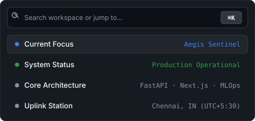
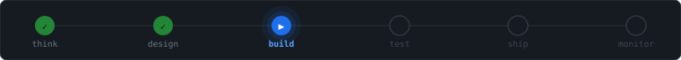
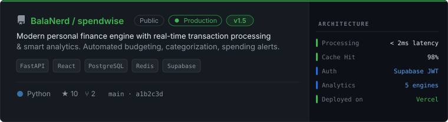
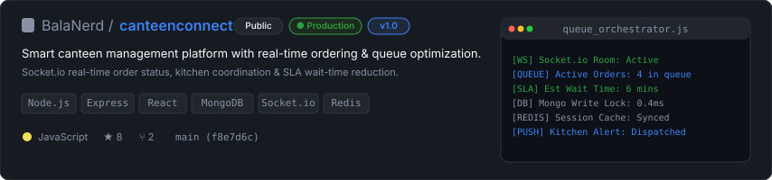

<!-- 
  S Bala Raju — Developer Workspace Profile
  Built with GitHub Next, Linear & Raycast UI Principles
-->

<!-- ═══════════════════════════════════════════════════
     §1 · HERO WORKSPACE & COMMAND PALETTE
════════════════════════════════════════════════════ -->

<table width="100%" border="0" cellspacing="0" cellpadding="0">
  <tr>
    <td width="50%" valign="top" align="left">
      <h1>S Bala Raju</h1>
      
<strong>Backend Engineer · AI Engineer · Full Stack Developer</strong>

      
Building intelligent software systems, scalable backend platforms, data pipelines, and production AI products.

      
📍 <em>Chennai, India (UTC +05:30)</em>

      

        <a href="https://github.com/BalaNerd"><code>GitHub</code></a> &nbsp;•&nbsp;
        <a href="https://www.linkedin.com/in/s-balaraju/"><code>LinkedIn</code></a> &nbsp;•&nbsp;
        <a href="mailto:balaraju1805@gmail.com"><code>Email</code></a>
      

    </td>
    <td width="50%" valign="top" align="right">
      
    </td>
  </tr>
</table>

 

<!-- ═══════════════════════════════════════════════════
     §2 · WHO I AM
════════════════════════════════════════════════════ -->

> I build software that solves real-world problems through clean system architecture, backend engineering, artificial intelligence, analytics, and thoughtful user experience. Work focuses on quality over quantity.

 

<!-- ═══════════════════════════════════════════════════
     §3 · ENGINEERING PHILOSOPHY
════════════════════════════════════════════════════ -->

### ⚡ Execution Pipeline

  

 

<!-- ═══════════════════════════════════════════════════
     §4 · FEATURED REPOSITORIES
════════════════════════════════════════════════════ -->

### 📦 Featured Repositories

  

 

  
  
<a href="https://spendwise-two-kappa.vercel.app/">Live Demo</a>

 

  
  
<a href="https://canteen-connect.onrender.com">Live Demo</a>

 

<!-- ═══════════════════════════════════════════════════
     §5 · EXPERIENCE & EDUCATION
════════════════════════════════════════════════════ -->

### 🏢 Experience &amp; Education

<table width="100%">
  <tr>
    <td width="50%" valign="top">
      <h4>🎓 Education</h4>
      
<strong>SRM Institute of Science and Technology</strong> 
      <code>B.Tech Computer Science Engineering</code> 
      Specialization: <em>Big Data Analytics</em> 
      CGPA: <code>8.61</code> &nbsp;•&nbsp; Expected: <code>2027</code>

    </td>
    <td width="50%" valign="top">
      <h4>💼 Internship</h4>
      
<strong>Zidio Development</strong> 
      <code>Data Scientist &amp; Analyst Intern</code> 
      Key Focus: 
      • Applied Machine Learning &amp; Analytics 
      • Production Backend Pipeline Optimization

    </td>
  </tr>
  <tr>
    <td width="50%" valign="top">
      <h4>🏆 Competitions &amp; Hackathons</h4>
      
• <strong>Hack the Horizon</strong> (24h Full Stack Sprint) 
      • <strong>NumeroHack</strong> (Mathematical Modeling) 
      • <strong>Analytical Problem Solving</strong>

    </td>
    <td width="50%" valign="top">
      <h4>📜 Certifications</h4>
      
• <strong>AWS Cloud Foundations</strong> 
      • <strong>NPTEL Problem Solving &amp; Data Structures</strong> 
      • <strong>Data Analytics Specialization</strong>

    </td>
  </tr>
</table>

 

<!-- ═══════════════════════════════════════════════════
     §6 · ENGINEERING DOMAINS & TECH ECOSYSTEM
════════════════════════════════════════════════════ -->

### ⚙️ Technology Ecosystem

<table width="100%">
  <tr>
    <td width="20%" valign="top"><strong>Backend</strong></td>
    <td width="80%">
      
      
      
      
      
      
      
      
    </td>
  </tr>
  <tr>
    <td width="20%" valign="top"><strong>Frontend</strong></td>
    <td width="80%">
      
      
      
      
      
    </td>
  </tr>
  <tr>
    <td width="20%" valign="top"><strong>AI &amp; Data</strong></td>
    <td width="80%">
      
      
      
      
      
      
      
    </td>
  </tr>
  <tr>
    <td width="20%" valign="top"><strong>Databases</strong></td>
    <td width="80%">
      
      
      
      
      
    </td>
  </tr>
  <tr>
    <td width="20%" valign="top"><strong>Cloud &amp; Tools</strong></td>
    <td width="80%">
      
      
      
      
      
      
    </td>
  </tr>
</table>

 

<!-- ═══════════════════════════════════════════════════
     §7 · GITHUB TELEMETRY & ACTIVITY
════════════════════════════════════════════════════ -->

### 📊 Telemetry &amp; Activity

  

 

<table width="100%">
  <tr>
    <td width="50%" align="center">
      
    </td>
    <td width="50%" align="center">
      
    </td>
  </tr>
</table>

 

<!-- ═══════════════════════════════════════════════════
     §8 · CURRENT FOCUS & ROADMAP
════════════════════════════════════════════════════ -->

### 🎯 Workspace Focus

<table width="100%">
  <tr>
    <td width="25%" valign="top">
      <strong>🔨 Building</strong> 
      <small>Aegis Sentinel v2 MLOps drift pipeline</small>
    </td>
    <td width="25%" valign="top">
      <strong>📚 Learning</strong> 
      <small>Distributed systems &amp; kernel networking</small>
    </td>
    <td width="25%" valign="top">
      <strong>🔬 Research</strong> 
      <small>Zero-trust security &amp; RAG optimization</small>
    </td>
    <td width="25%" valign="top">
      <strong>🚀 Next</strong> 
      <small>Public beta release for SpendWise</small>
    </td>
  </tr>
</table>

 

<!-- ═══════════════════════════════════════════════════
     §9 · FOOTER & ACTIONS
════════════════════════════════════════════════════ -->

<table width="100%">
  <tr>
    <td align="left">
      <code>balaraju1805@gmail.com</code> &nbsp;•&nbsp;
      <a href="https://github.com/BalaNerd">github.com/BalaNerd</a> &nbsp;•&nbsp;
      <a href="https://www.linkedin.com/in/s-balaraju/">linkedin.com/in/s-balaraju</a>
    </td>
    <td align="right">
      <small>S Bala Raju · Workspace v3.0</small>
    </td>
  </tr>
</table>
