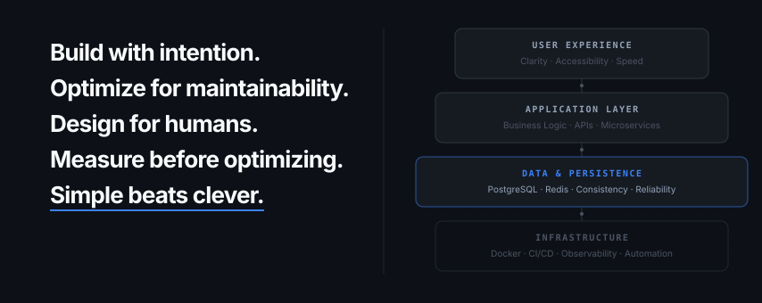
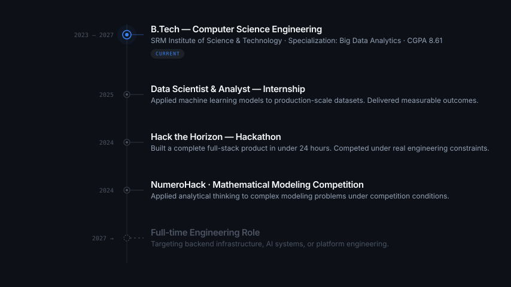

<!--
  ─────────────────────────────────────────────────────
  S Bala Raju · GitHub Profile
  Design System v1.0
  ─────────────────────────────────────────────────────
-->

<!-- ═══════════════════════════════════════════════════
     §1 · HERO
════════════════════════════════════════════════════ -->

  

 

  
  &nbsp;
  
  &nbsp;
  

 
 

<!-- ═══════════════════════════════════════════════════
     §2 · WHO I AM
════════════════════════════════════════════════════ -->

  <code>WHO I AM</code>

 

I'm a backend engineer and AI builder based in Chennai, India, currently pursuing a B.Tech in Computer Science Engineering with a specialization in Big Data Analytics at SRM Institute of Science and Technology (CGPA 8.61, graduating 2027).

I build software that solves real-world problems through clean system architecture, backend engineering, artificial intelligence, and data analytics. My focus is on work that scales, endures, and feels polished — not just code that passes a test.

My engineering approach is shaped by one belief: **quality over quantity**. Every system I build should feel like a real product.

 
 

  

 

<!-- ═══════════════════════════════════════════════════
     §3 · ENGINEERING PHILOSOPHY
════════════════════════════════════════════════════ -->

  <code>ENGINEERING PHILOSOPHY</code>

 

  

 
 

  

 

<!-- ═══════════════════════════════════════════════════
     §4 · FEATURED PRODUCTS
════════════════════════════════════════════════════ -->

  <code>FEATURED PRODUCTS</code>

 

<!-- ── AEGIS SENTINEL — Flagship ── -->

  

 

**Aegis Sentinel** is an AI-powered disaster intelligence platform that monitors wildfires, earthquakes, and severe weather events in real time. It combines geospatial analysis, autonomous MLOps pipelines, and a RAG-powered knowledge engine to deliver actionable intelligence — not just raw data.

The system ingests live feeds from USGS, NASA FIRMS, and weather APIs, processes them through a feature store pipeline, detects model drift, retrains automatically, and surfaces risk scores to a Next.js dashboard with full command-palette support.

<strong>Architecture &amp; Engineering Highlights</strong>

 

| Component | Technology | Purpose |
|:---|:---|:---|
| Backend API | FastAPI + Celery | Async task orchestration, REST endpoints |
| ML Pipeline | scikit-learn, PyTorch | Training, drift detection, evaluation |
| RAG Engine | Retrieval-Augmented Generation | Domain knowledge retrieval |
| Geospatial | PostGIS, spatial ops | Geographic risk analysis |
| Streaming | Redis Pub/Sub | Real-time event broadcasting |
| Auth | JWT + bcrypt | Secure user sessions |
| Migrations | Alembic | PostgreSQL schema versioning |
| Frontend | Next.js + TypeScript | Dashboard, command palette, maps |
| Infrastructure | Docker Compose | Local orchestration |

 

<!-- ── SpendWise + CanteenConnect — Side by side ── -->

| | |
|:---:|:---:|
|  |  |

 
 

  

 

<!-- ═══════════════════════════════════════════════════
     §5 · EXPERIENCE TIMELINE
════════════════════════════════════════════════════ -->

  <code>EXPERIENCE</code>

 

  

 
 

  

 

<!-- ═══════════════════════════════════════════════════
     §6 · ENGINEERING DOMAINS
════════════════════════════════════════════════════ -->

  <code>ENGINEERING DOMAINS</code>

 

| Backend Engineering | AI & Machine Learning | Data Analytics |
|:---|:---|:---|
| System design, API architecture, microservices, async task pipelines, real-time event streaming | MLOps pipelines, model training & evaluation, drift detection, RAG knowledge systems | ETL, feature engineering, geospatial analysis, visualization |

| System Architecture | API Engineering | Automation & DevOps |
|:---|:---|:---|
| Distributed systems, database design, caching strategies, scalability patterns | REST, GraphQL, gRPC, WebSocket, rate limiting, versioning | CI/CD, Docker, observability, alerting, infrastructure-as-code |

 
 

  

 

<!-- ═══════════════════════════════════════════════════
     §7 · TECHNOLOGY ECOSYSTEM
════════════════════════════════════════════════════ -->

  <code>TECHNOLOGY ECOSYSTEM</code>

 

**Languages**

**Backend**

**Frontend**

**AI & Data**

**Databases**

**Cloud & DevOps**

 
 

  

 

<!-- ═══════════════════════════════════════════════════
     §8 · GITHUB ACTIVITY
════════════════════════════════════════════════════ -->

  <code>GITHUB ACTIVITY</code>

 

  

 

&nbsp;

 
 

  

 

<!-- ═══════════════════════════════════════════════════
     §9 · CURRENT FOCUS
════════════════════════════════════════════════════ -->

  <code>CURRENT FOCUS</code>

 

| Building | Learning | Research | Next |
|:---|:---|:---|:---|
| Aegis Sentinel v2 — enhanced ML pipeline and alerting | Distributed systems internals, eBPF | Zero-trust architecture patterns, LLM fine-tuning | Open-source first library |
| SpendWise public beta | Advanced PostgreSQL optimization | MLOps best practices at scale | Contribution to major OSS project |

 
 

  

 

<!-- ═══════════════════════════════════════════════════
     §10 · CONNECT
════════════════════════════════════════════════════ -->

  <code>CONNECT</code>

 

If you're building something that genuinely matters — something that requires real engineering — 
I'd like to hear about it.

 

[`balaraju1805@gmail.com`](mailto:balaraju1805@gmail.com) &emsp; [`linkedin.com/in/s-balaraju`](https://www.linkedin.com/in/s-balaraju/) &emsp; [`github.com/BalaNerd`](https://github.com/BalaNerd)

 
 

---

  Designed with intention &nbsp;·&nbsp; Built to last

